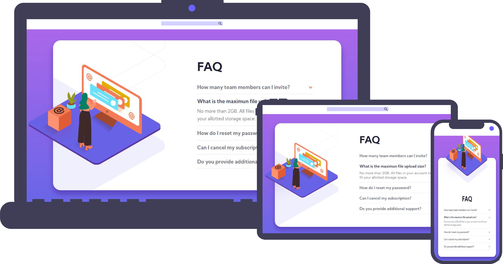

# article-preview-component
Challenge by Frontend Mentor 💻

## Challenge


## Live Application URL ✨

The Application is deployed in https://

Click on the link to see the application

## Cloning and Running the Application in local 🔮

Clone the project into local

Install all the npm packages. Go into the project folder and type the following command to install all npm packages

```bash
npm install
```

In order to run the application Type the following command

```bash
npm start
```